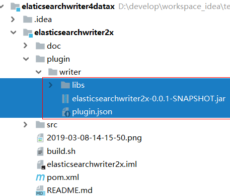
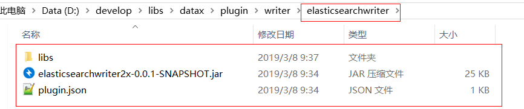
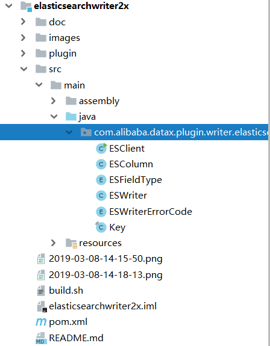

# ElasticSearchWriter4Datax
##  1.快速介绍
Datax原有的elasticsearchWriter插件对版本支持不太友好,因为项目中用到ElasticSearch2.4版本,在Datax原来的基础上,保持原本的代码逻辑,针对ElasticSearch2.4版本做了二次开发.
##  2.Quick Start
1.  使用已经打包好的jar包替换Datax原来的插件(推荐)

2.  自己编译源码(不推荐)

####注:因为插件依赖Datax的一些核心模块,所以编译源码需要提前maven install Datax的相关模块
##  3.参数配置说明
跟Datax原本的Elasticsearchwriter插件的参数配置几乎一样.
请参考[Datax ElasticSearchWriter的官方文档](https://github.com/alibaba/DataX/blob/master/elasticsearchwriter/doc/elasticsearchwriter.md)
### 对别名的特别说明:
1.  es库里不要有跟别名名称一样的索引存在,不然别名的配置会出错
2.  aliasMode配置为append则是别名增量模式,配置为exclusive则只保留这一个别名配置,接触其他索引与该别名的绑定
##  4.注意事项
1.  本插件只用在了ElasticSearch2.4版本上,不能保证支持其他2.x版本
##  5.ToDo
1.  准备抽时间开发适配Elasticsearch6.x版本的writer插件

